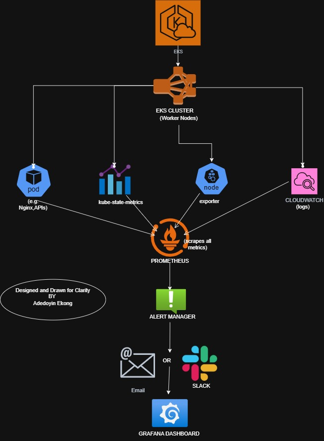
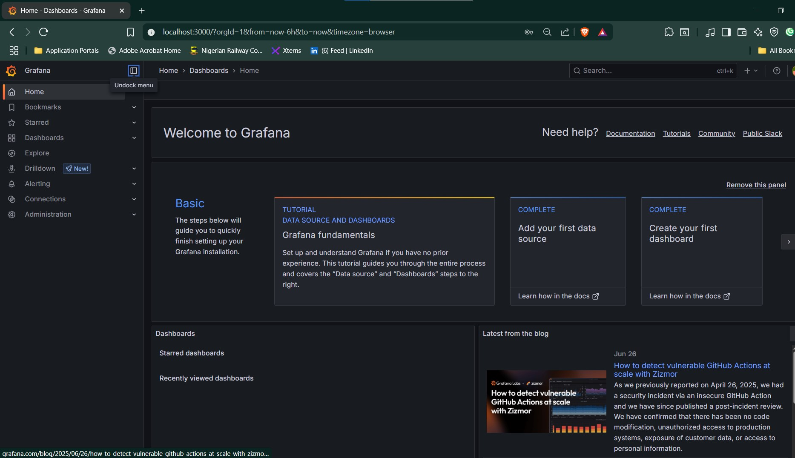
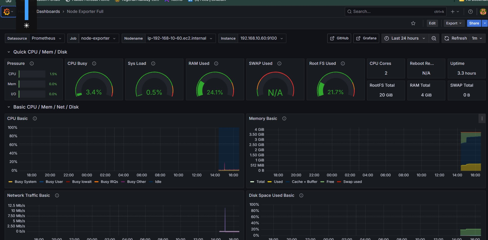
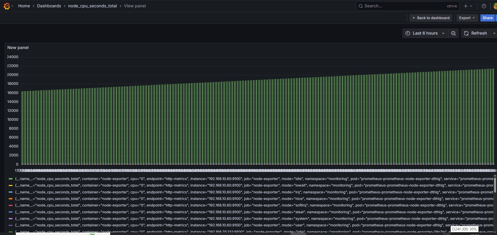
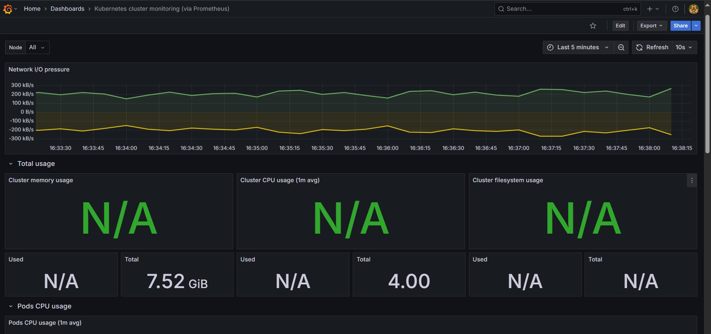
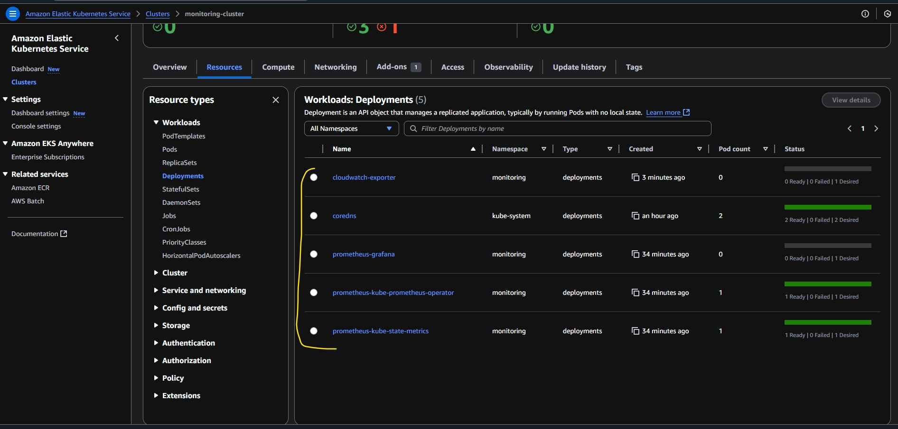
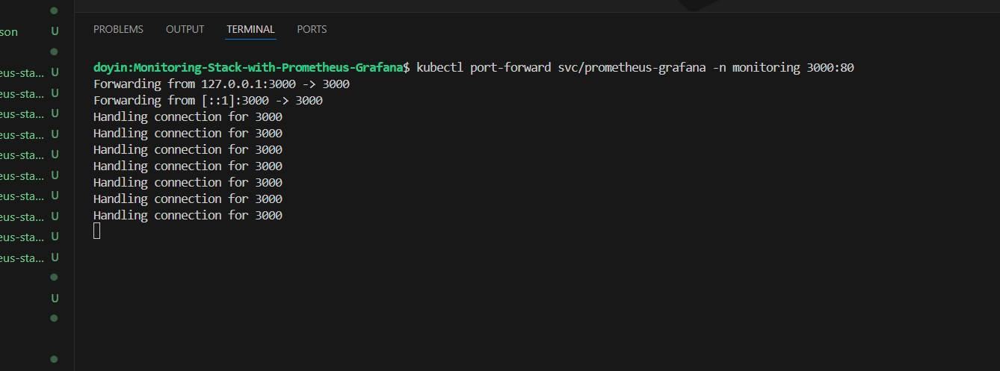
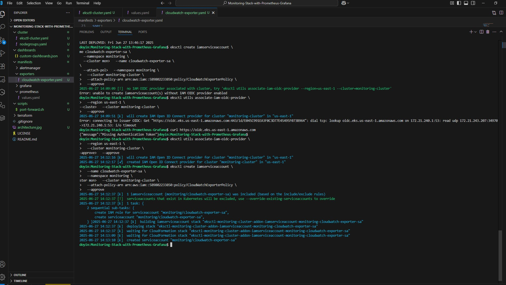
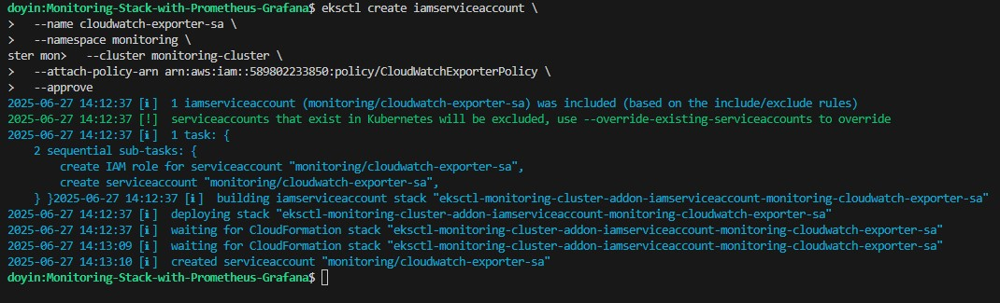
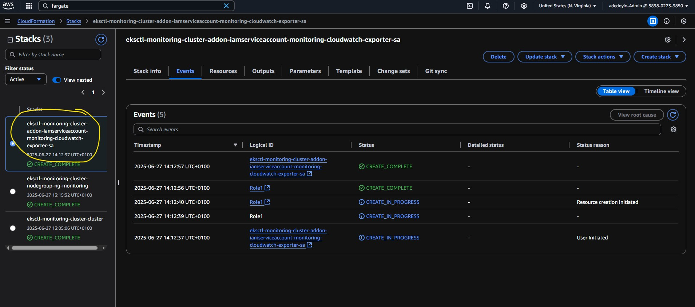

# Monitoring Kubernetes on AWS EKS with Prometheus and Grafana


---

## Project Overview

This project showcases how to build a robust monitoring stack for Kubernetes clusters on **AWS EKS** using **Prometheus**, **Grafana**, **kube-state-metrics**, **node-exporter**, and optional integration with **CloudWatch** and **Alertmanager**.

The setup simulates real-world observability and telemetry needs for modern cloud-native applications. This includes real-time metrics scraping, visualization, and alerting.

---

## Why This Project Matters

This wasn’t built for training or content creation. This was built because **it’s what I do.**

As a Cloud/DevOps Engineer, I often need to set up full observability pipelines under time, budget, and security constraints. This stack reflects my approach when building from scratch, under realistic conditions.

One major challenge was **cost**. EKS isn’t cheap—even for demo purposes. Running persistent volumes, node groups, CloudWatch exporters, and dashboards quickly adds up. That’s why I didn’t go deeper into long-term storage backends or multi-tenant alerting.

This project demonstrates my ability to:

* Provision and monitor Kubernetes clusters on AWS
* Integrate IAM roles with Kubernetes service accounts
* Configure exporters and scrape metrics with Prometheus
* Visualize cluster health and pod metrics with Grafana
* Solve deployment, IAM, and dashboard issues in a hands-on, production-style setup

The goal: **Showcase my skill set.**

---

## Architecture



---

## ⚙️ Stack Overview

* **Infrastructure**: AWS EKS (provisioned via `eksctl`)
* **Metrics Collection**: Prometheus Operator Helm chart
* **Data Sources**: `kube-state-metrics`, `node-exporter`, `cloudwatch-exporter`
* **Dashboards**: Grafana
* **Alerting**: Alertmanager
* **Security**: IAM roles for service accounts (IRSA)

---

## 📁 Project Structure

```bash
Monitoring-Stack-with-Prometheus-Grafana/
├── cluster/                          # eksctl cluster definition
│   └── eksctl-cluster.yaml
├── dashboards/                      # JSON-based Grafana dashboards
│   ├── custom-app-dashboard.json
│   ├── custom-dashboards.json
│   ├── kube-cluster.json
│   └── node-exporter.json
├── manifests/                       # Helm values and K8s manifests
│   ├── alertmanager/
│   │   └── alertmanager-config.yaml
│   ├── exporters/
│   │   └── cloudwatch-exporter.yaml
│   ├── prometheus/
│   │   └── values.yaml
│   └── storage/
│       └── gp2-default-storageclass.yaml
├── scripts/
│   └── port-forward.sh
├── terraform/                       # Optional IAM setup
├── IMAGES/                          # Screenshot folder
├── LICENSE
├── README.md
└── troubleshooting-cloudwatch-exporter-grafana-pvc-ebs.md
```

---

## 🔧 Technical Implementation Details

### 1. **Provision EKS Cluster**

```bash
eksctl create cluster -f cluster/eksctl-cluster.yaml
```

* Configured with public subnets, managed node groups, IAM OIDC provider
* Enabled IRSA (IAM Roles for Service Accounts)

### 2. **Setup Monitoring Namespace and Deploy Stack**

```bash
kubectl create namespace monitoring
helm repo add prometheus-community https://prometheus-community.github.io/helm-charts
helm install prometheus prometheus-community/kube-prometheus-stack \
  -n monitoring -f manifests/prometheus/values.yaml
```

### 3. **Access Grafana Dashboard**

```bash
export POD_NAME=$(kubectl -n monitoring get pod -l "app.kubernetes.io/name=grafana" -o jsonpath="{.items[0].metadata.name}")
kubectl port-forward -n monitoring $POD_NAME 3000
```

* Default credentials: `admin / <auto-generated-password>`
* Change after first login

### 4. **CloudWatch Exporter IAM Setup**

* Attached IAM policy to service account

!\[IAM Policy]\(IMAGES/IAM EXPORTER POLICY.jpg)

---

## 📊 Dashboards

### Grafana UI



### Node Exporter (CPU, Disk, Memory)



### Prometheus Stats

!\[Prometheus Overview]\(IMAGES/Prometheus 2.0 Stats.jpg)
!\[Prometheus Details]\(IMAGES/Prometheus 2.0 Stats2.jpg)

### Raw Query: `container_cpu_usage_seconds_total`



### Custom Dashboards



---

## 📸 Deployment Highlights

### Helm Deploy Output



### Port Forwarding



### Troubleshooting IAM and CloudWatch Exporter





---

## 📽️ YouTube Video

A full walkthrough video is available on my channel: [DoyinEkong YouTube](https://www.youtube.com/@doyinekong/playlists)

---

## 📬 Contact & Contributor


Created and maintained by [Adedoyin Ekong](https://github.com/doyindevops) – Cloud & DevOps Engineer
Email: [doyindevops@gmail.com](mailto:doyindevops@gmail.com)

---

## 🧼 Cleanup

To delete the entire cluster:

```bash
eksctl delete cluster -f cluster/eksctl-cluster.yaml --disable-nodegroup-eviction
```

Check:

* EKS console
* CloudFormation stacks
* IAM roles (especially for service accounts)
* ELB (Load balancers)
* EC2 instances
* CloudWatch dashboards/logs

---

## License

This project is licensed under the MIT License.
